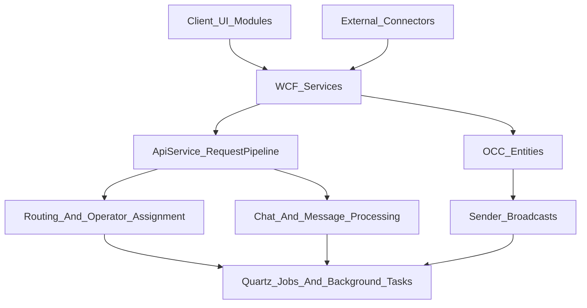

# Архитектура OCC-подсистем

<!-- Версия: 1.1 | Обновлено: 2026-04-27 | Платформа: BPMSoft 1.9 -->
<!-- Теги: OCC, omnichannel, чат, каналы, оператор, routing, sender, whatsapp -->

> Обзор OCC-контура платформы BPMSoft: пакеты `BPMSoftOCC`, `BPMSoftOCCWAMfmsJson`, `BPMSoftSender`, их роли, связи и основные точки расширения.
> Единый маршрут по OCC / Omnichannel Dive см. в
> [occ-omnichannel-overview.md](../server/occ-omnichannel-overview.md).

## Обзор

OCC в базовом решении BPMSoft отвечает за омниканальные коммуникации:

- регистрацию и настройку каналов;
- обработку входящих и исходящих сообщений;
- работу операторов, очередей и маршрутизации чатов;
- фоновые задания для routing, AFK, статусов и служебной синхронизации;
- массовые рассылки через связанные сущности и процессы Sender.

В коде OCC-контур распределён между несколькими пакетами:

| Пакет | Роль |
| ----- | ---- |
| `BPMSoftOCC` | Ядро омниканального чата: каналы, чаты, сообщения, операторы, routing, WCF-сервисы, процессы |
| `BPMSoftOCCWAMfmsJson` | Расширение для WhatsApp webhook-интеграции (`wa/edna` и legacy `wa/mfms/json`) |
| `BPMSoftSender` | Рассылки поверх OCC: доставка, получатели, каналы рассылки, macros, scheduler и UI рассылки |

## Место в архитектуре

## Основные подсистемы

### 1. Каналы и конфигурация

Пакет `BPMSoftOCC` хранит конфигурацию каналов в сущности `BPMSoftOCCChannel` и связанных lookup/деталях операторов и очередей. Сервис `BPMSoftOCCAddChannelService` формирует payload для разных типов каналов и вызывает внешний connector API, а затем создаёт запись канала в BPMSoft.

Поддерживаются разные типы каналов: Facebook, VK, VK Wall, Skype, API, Twitter, Teams, WhatsApp, WeChat, Workplace, Line, Instagram, Max. Для части каналов используются собственные JSON-поля токена, а для части - отдельные `InternalId`, `ChannelId`, app credentials и URL webhook.

Ключевые файлы:

- `Autogenerated/Src/BPMSoftOCCAddChannelService.BPMSoftOCC.cs`
- `Autogenerated/Src/BPMSoftOCCChannelPage.BPMSoftOCC.js`
- `Autogenerated/Src/BPMSoftOCCChannelView.BPMSoftOCC.js`

### 2. Чаты, сообщения и клиенты

Базовый домен OCC строится вокруг сущностей:

- `BPMSoftOCCChat`
- `BPMSoftOCCChatMessage`
- `BPMSoftOCCClient`
- `BPMSoftOCCSession`
- `BPMSoftOCCChannel`

Сервис `BPMSoftOCCChatService` и связанные API-слои выполняют типовые действия над чатом:

- смена статуса оператора;
- push/process chat;
- закрытие чата;
- создание site channel;
- синхронизация данных клиента и chat metadata;
- long-polling/доставку сообщений в UI.

Ключевые файлы:

- `Autogenerated/Src/BPMSoftOCCService.BPMSoftOCC.cs`
- `Autogenerated/Src/BPMSoftOCCApi.BPMSoftOCC.cs`
- `Autogenerated/Src/BPMSoftOCCChatServiceV2.BPMSoftOCC.cs`

### 3. Операторы, очереди и маршрутизация

Routing в OCC включает:

- выбор оператора по каналу и очереди;
- обработку transfer/group transfer;
- контроль AFK / timeout / logout;
- фоновые задания маршрутизации.

В коде это реализовано через комбинацию:

- `RequestHandler` / request pipeline;
- `BPMSoftOCCTransferService`;
- `ChatRoutingJob`, `SaveAFKChatJob`, `ScheduleOperatorLogoutJob`, `RequestHandlingJob`;
- сущности операторов, operator unit group и привязок каналов к операторам.

Ключевые файлы:

- `Autogenerated/Src/BPMSoftOCCRouting.BPMSoftOCC.cs`
- `Autogenerated/Src/BPMSoftOCCStrategy.BPMSoftOCC.cs`
- `Autogenerated/Src/BPMSoftOCCTransferService.BPMSoftOCC.cs`
- `Autogenerated/Src/BPMSoftOCCOperatorLogoutSchema.BPMSoftOCC.cs`

### 4. Входящие запросы от connector и request pipeline

Внешние каналы и connector отправляют в BPMSoft OCC-запросы и статусы сообщений. Для этого используется `BPMSoftOCCChatRequestService`, который:

- принимает коллекции запросов;
- сохраняет сырое содержимое в `BPMSoftOCCChatRequest`;
- передаёт обработку в `BPMSoftOCC.RequestPipeline.RequestHandler`;
- отдельно принимает typing events и message status callbacks.

Это критический входной слой интеграции между внешним мессенджером и внутренней моделью чатов.

Ключевые файлы:

- `Autogenerated/Src/BPMSoftOCCChatRequestService.BPMSoftOCC.cs`
- `Autogenerated/Src/BPMSoftOCCApi.BPMSoftOCC.cs`

### 5. Фоновые задачи и scheduler

OCC использует два механизма фоновой обработки:

- Quartz job'ы (`IJobExecutor`) для планируемых задач;
- background task'и (`IBackgroundTask<T>`) для вспомогательной асинхронной логики.

Для OCC важны:

- `RequestHandlingJob`
- `ChatRoutingJob`
- `SaveAFKChatJob`
- `ScheduleOperatorLogoutJob`
- `BackgroundSendLastMessage`
- `BackgroundSaveLastMessageToChat`

Для Sender поверх OCC важны:

- `BPMSoftSenderDeliverySchedulerJob`
- `BPMSoftSenderStatusJob`
- `BSChatRoutingJob`

Подробности по Quartz см. в [scheduler-quartz.md](../server/scheduler-quartz.md),
сводную карту OCC/Sender jobs - в [occ-jobs-map.md](../server/occ-jobs-map.md),
а по Sender - в [bpmsoft-sender.md](../extended/bpmsoft-sender.md).

### 6. WhatsApp MFMS/Edna расширение

`BPMSoftOCCWAMfmsJson` - это специализированное расширение канала WhatsApp. Оно переопределяет стандартный сценарий создания канала:

- добавляет собственный сервис `BPMSoftOCCAddMfmsJsonService`;
- хранит параметры подключения в JSON внутри `Token`;
- поддерживает два варианта endpoint:
  - `wa/edna`
  - `wa/mfms/json` (legacy)

См. отдельный документ: [occ-whatsapp-mfms-json.md](../server/occ-whatsapp-mfms-json.md).

### 7. Sender как надстройка над OCC

`BPMSoftSender` использует OCC-сущности и каналы для массовой доставки сообщений. Его зона ответственности:

- модель рассылки `BPMSoftOCCDelivery`;
- получатели, группы получателей, каналы рассылки, senders, macros;
- UI страницы настройки рассылки;
- scheduler и служебные сервисы отправки и обновления статусов;
- создание сообщений и чатов по каналам доставки.

См. отдельный документ: [bpmsoft-sender.md](../extended/bpmsoft-sender.md).

## Типовые потоки

### Добавление канала

1. Пользователь заполняет страницу канала.
2. Клиентский модуль выбирает сервис добавления канала.
3. Серверный WCF-сервис формирует JSON для connector API.
4. При успешном ответе создаётся запись `BPMSoftOCCChannel`.

### Обработка входящего сообщения

1. Connector вызывает OCC service endpoint.
2. Запрос сохраняется в `BPMSoftOCCChatRequest`.
3. `RequestHandler` разбирает payload и обновляет доменные сущности.
4. UI и операторы получают обновления через OCC messaging / сервисный слой.

### Массовая рассылка

1. Пользователь настраивает `BPMSoftOCCDelivery`.
2. `BSSchedulerService` или `BSDeliveryService` планирует запуск.
3. Quartz-задачи Sender обрабатывают получателей и каналы.
4. Создаются чаты/сообщения и обновляются статусы доставки.

## Точки расширения

Наиболее частые точки доработки OCC:

- добавление нового типа канала;
- кастомизация страницы канала или страницы чата;
- изменение routing-логики оператора;
- обработка новых типов connector request/status callback;
- новые sender-сценарии и расписания рассылок;
- интеграционные настройки через SysSettings и feature flags.

При таких задачах обычно нужны следующие документы:

- [bpmsoft-occ-services.md](../server/bpmsoft-occ-services.md)
- [occ-request-pipeline.md](../server/occ-request-pipeline.md)
- [occ-outgoing-connector.md](../server/occ-outgoing-connector.md)
- [occ-routing-strategy.md](../server/occ-routing-strategy.md)
- [occ-jobs-map.md](../server/occ-jobs-map.md)
- [occ-channel-integrations.md](../server/occ-channel-integrations.md)
- [occ-client-ui.md](../client/occ-client-ui.md)
- [occ-message-types.md](../reference/occ-message-types.md)
- [bpmsoft-occ-entities.md](../reference/bpmsoft-occ-entities.md)
- [bpmsoft-occ-settings.md](../reference/bpmsoft-occ-settings.md)
- [occ-boundaries.md](../server/occ-boundaries.md)
- [occ-pattern-catalog.md](../server/occ-pattern-catalog.md)
- [occ-troubleshooting.md](../server/occ-troubleshooting.md)
- [occ-whatsapp-mfms-json.md](../server/occ-whatsapp-mfms-json.md)
- [bpmsoft-sender.md](../extended/bpmsoft-sender.md)

## Ключевые файлы

| Область | Файлы |
| ----- | ----- |
| OCC chat services | `BPMSoftOCCService.BPMSoftOCC.cs`, `BPMSoftOCCChatServiceV2.BPMSoftOCC.cs` |
| API / request pipeline | `BPMSoftOCCApi.BPMSoftOCC.cs`, `BPMSoftOCCChatRequestService.BPMSoftOCC.cs` |
| Channels | `BPMSoftOCCAddChannelService.BPMSoftOCC.cs`, `BPMSoftOCCChannelPage.BPMSoftOCC.js` |
| Setup | `BPMSoftOCCSetupService.BPMSoftOCC.cs` |
| Transfer / routing | `BPMSoftOCCTransferService.BPMSoftOCC.cs`, `BPMSoftOCCRouting.BPMSoftOCC.cs`, `BPMSoftOCCStrategy.BPMSoftOCC.cs` |
| WhatsApp MFMS/Edna | `BPMSoftOCCAddMfmsJsonService.BPMSoftOCCWAMfmsJson.cs`, `BPMSoftOCCWhatsAppChannelView.BPMSoftOCCWAMfmsJson.js` |
| Sender | `BSDeliverySource.BPMSoftSender.cs`, `BSSchedulerService.BPMSoftSender.cs`, `BPMSoftOCCDelivery1Page.BPMSoftSender.js` |

## Связанные документы

- [Обзор платформы](platform-overview.md)
- [OCC Omnichannel Overview](../server/occ-omnichannel-overview.md)
- [WCF-сервисы OCC](../server/bpmsoft-occ-services.md)
- [Сущности OCC](../reference/bpmsoft-occ-entities.md)
- [Настройки OCC](../reference/bpmsoft-occ-settings.md)
- [Request pipeline OCC](../server/occ-request-pipeline.md)
- [Outgoing connector flow OCC](../server/occ-outgoing-connector.md)
- [Routing и AFK OCC](../server/occ-routing-strategy.md)
- [OCC / Sender Jobs Map](../server/occ-jobs-map.md)
- [Каналы OCC](../server/occ-channel-integrations.md)
- [Клиентский OCC UI](../client/occ-client-ui.md)
- [Типы сообщений OCC](../reference/occ-message-types.md)
- [Границы OCC](../server/occ-boundaries.md)
- [Каталог OCC-паттернов](../server/occ-pattern-catalog.md)
- [Troubleshooting OCC](../server/occ-troubleshooting.md)
- [WhatsApp MFMS/Edna](../server/occ-whatsapp-mfms-json.md)
- [Sender в OCC-контуре](../extended/bpmsoft-sender.md)
- [Quartz / AppScheduler](../server/scheduler-quartz.md)
