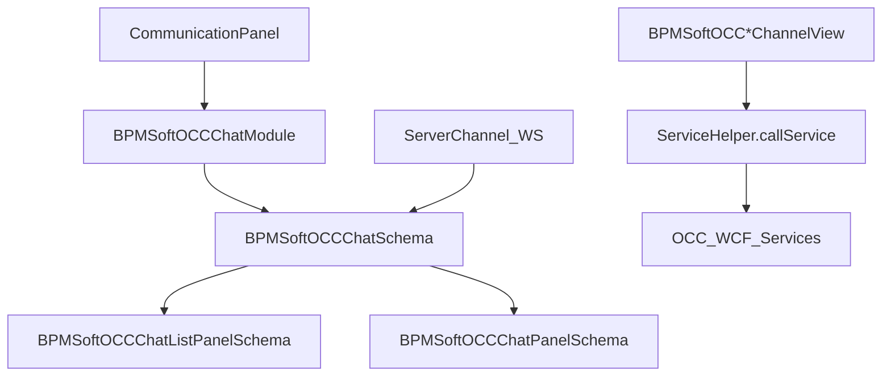

# Клиентский OCC UI и Channel Views

<!-- Версия: 1.0 | Обновлено: 2026-04-27 | Платформа: BPMSoft 1.9 -->
<!-- Теги: OCC, client, UI, CommunicationPanel, sandbox, ServiceHelper, ChannelView -->

> Deep dive по клиентской части OCC: как чат встраивается в communication panel, как устроены chat/list/panel модули, какие sandbox-сообщения используются и как channel views вызывают серверные сервисы.

## Обзор

Клиентская часть OCC на classic UI строится как AMD-набор модулей поверх `sandbox`, `ServiceHelper` и websocket-событий `BPMSoft.ServerChannel`.

Ключевые слои:

1. `CommunicationPanel` - entrypoint и счётчик чатов.
1. `BPMSoftOCCChatModule` - shell-модуль, подключающий основную схему.
1. `BPMSoftOCCChatSchema` - центральный координатор правой панели.
1. `BPMSoftOCCChatListPanelSchema` - список чатов.
1. `BPMSoftOCCChatPanelSchema` - таймлайн и действия с сообщениями.
1. `BPMSoftOCC*ChannelView*.js` - wizard/forms для добавления каналов.

## Точка входа: `CommunicationPanel`

`Autogenerated/Src/CommunicationPanel.BPMSoftOCC.js` добавляет OCC в стандартную communication panel.

### Что делает модуль

- создаёт virtual attributes `ChatCounter`, `ChatVisible`, `ChatCollection`;
- проверяет, есть ли у текущего пользователя `BPMSoftOCCOperatorUnit`;
- загружает модуль `BPMSoftOCCChat`;
- подписывается на websocket-сообщения `BPMSoft.ServerChannel.on(...)`;
- обновляет бейдж количества чатов.

### Server-side вызовы

На старте модуль вызывает:

| Сервис | Метод | Зачем |
| ----- | ----- | ----- |
| `BPMSoftOCCChatService` | `GetMyChats` | Инициализация счётчика и коллекции открытых чатов |

### Реакция на websocket

На уровне communication panel учитываются только:

- `NewChat`
- `CloseChats`

Это минимальный слой уведомлений и счётчика, не сам UI таймлайна.

## `BPMSoftOCCChatModule`

`BPMSoftOCCChatModule.BPMSoftOCC.js` - тонкий shell над `BPMSoftOCCChatSchema`.

Особенности:

- `extend: "BPMSoft.BaseSchemaModule"`
- `schemaName: "BPMSoftOCCChatSchema"`
- `useHistoryState: false`

То есть основная логика живёт не в модуле, а в самой схеме.

## Центральный координатор: `BPMSoftOCCChatSchema`

`BPMSoftOCCChatSchema.BPMSoftOCC.js` - центральная схема OCC workspace.

### Зона ответственности

- маршрутизация websocket-событий;
- синхронизация list panel и message panel;
- хранение `SelectedChat` и `SelectedChatEntity`;
- публикация sandbox-событий между подмодулями;
- отображение данных клиента, контакта и чата;
- работа с edit/delete/message status updates.

### Ключевые virtual attributes

| Атрибут | Назначение |
| ----- | ----- |
| `SelectedChatEntity` | Текущая сущность выбранного чата |
| `SelectedChat` | Id текущего чата |
| `IsWhatsAppChannelType` | Channel-specific поведение UI |
| `ChatName`, `ChatLink` | Отображение карточки чата |
| `ClientName`, `ClientContactName`, `ClientContactLink` | Данные клиента |
| `ShowChatContainer`, `ShowBindButton`, `ShowClientName` | UI state |

### Основные sandbox-сообщения

| Сообщение | Направление | Смысл |
| ----- | ----- | ----- |
| `ChatSelected` | subscribe | Выбран чат в списке |
| `NewMessage` | publish | Новый message в panel/list |
| `NewChat` | publish | Новый чат |
| `UpdateChat` | publish | Обновить карточку чата |
| `CloseChat` | publish | Закрытие чата |
| `MessageStatusUpdate` | publish | Обновление статуса доставки |
| `TransferChat` | publish | Transfer UI flow |
| `ClientIsTyping` | publish | Клиент печатает |
| `MessageEditStatusUpdate` | publish | Обновление edit/delete статусов |
| `EditMessageUpdate` | publish | UI refresh после редактирования |

### Websocket-router

`onWebSocketMessage(...)` принимает сообщения канала `BPMSoftOCCChat` и маршрутизирует:

- `ChangeStatus`
- `NewChat`
- `NewMessage`
- `UpdateMessage`
- `ClientIsTyping`
- `MessageBatchStatusUpdate`
- `MessageEditMessageInfo`
- `EditMessageUpdate`

Практически `BPMSoftOCCChatSchema` - это bridge между server push и sandbox-событиями UI.

## `BPMSoftOCCChatListPanelSchema`

Эта схема отвечает за левую колонку списка чатов.

### Модель элемента списка

`ChatViewModel` хранит:

- `Id`
- `CreatedOn`
- `InternalChatId`
- `LastMessage`
- `Client`
- `Operator`
- `Channel`
- `Closed`
- `Processing`
- `IsGroupChat`

### Поведение списка

При клике на чат:

1. публикуется `ChatSelected`;
1. при необходимости вызывается `BPMSoftOCCChatService.ProcessChat`;
1. чат переводится в `Processing = true`.

### Channel icon mapping

В `getChannelImg()` жёстко сопоставлены icon resources для каналов:

- Telegram
- Facebook / Messenger
- Viber
- VK / VKWall
- Skype
- Twitter
- Teams
- WhatsApp
- WeChat
- Workplace
- Instagram
- Line
- Max
- Site / API fallback

Это удобная точка, когда нужно понять, почему канал в списке выглядит определённым образом.

## `BPMSoftOCCChatPanelSchema`

Эта схема отвечает за таймлайн и отдельные сообщения.

### `ChatMessageViewModel`

В модель сообщения входят:

- `Id`
- `ChatFileId`
- `ChatId`
- `Type`
- `InternalId`
- `Text`
- `SendByOperator`
- `Client`
- `Operator`
- `CreatedOn`
- `ImageUrl`
- `QuotationInfo`
- `QuotationTime`
- `MessageStatus`
- `ChatMessageStatusIconSrc`
- `MessageActionsCaptionText`
- `MessageTypeClassWrapper`
- `IsErrorWithEditMessage`
- `MessageWasEdited`
- `IsCreatedStatus`

### Что делает panel

- рисует таймлайн и rich-content;
- переводит status codes в иконки;
- отображает edit/delete статусы;
- показывает typing и delivery state;
- управляет message actions.

### Mapping delivery статусов на UI

В `getChatMessageStatusIconSrcAndIsCreated(...)` явно используются коды:

- `200` - sent
- `300` - error/not delivered
- `400` - delivered
- `500` - error
- `600` - read
- default - created

Значит именно здесь server status callbacks превращаются в визуальные индикаторы сообщения.

## Карточки и section/page сценарии

Помимо правой панели есть отдельные OCC-страницы и секции.

### `BPMSoftOCCChat1Page`

Карточка чата:

- подписывается на `ReloadEntity`;
- вызывает `BPMSoftOCCChatService.CloseChat`;
- вызывает `BPMSoftOCCChatService.NewMessageUpdater`;
- вызывает `BPMSoftOCCChatService.SetContinueChatDate`;
- координируется с секцией через `ShowContinueButtonInSection`.

Это отдельный record-page слой поверх live-chat UI.

### `BPMSoftOCCGroupChatPage` / `BPMSoftOCCGroupChatSection`

Используются для group chat сценариев и тоже координируются через `sandbox`.

## Channel views

### Базовый паттерн

`BPMSoftOCCChannelView.BPMSoftOCC.js` задаёт общий шаблон UI для добавления канала:

- virtual attributes `AllIsBad`, `ErrorText`, `ConfigurationId`, `ChannelId`;
- сообщения `GetTypeId`, `BackToPrevios`, `AfterAdding`, `StartLoadingMask`, `StopLoadingMask`;
- form fields (`Name`, `Token`, `Weight`);
- вызов `BPMSoftOCCAddChannelService.AddDefaultChannel`.

То есть большинство channel views - это вариации одной формы и одного service-call паттерна.

### Общий UX-поток channel view

1. View получает `TypeId`.
1. Пользователь заполняет поля.
1. View публикует `StartLoadingMask`.
1. Вызывается `ServiceHelper.callService(...)`.
1. После ответа публикуется `StopLoadingMask`.
1. При успехе публикуется `AfterAdding`.

### Специализированные view

Отдельные файлы переопределяют вызов сервиса под конкретный канал:

| View | Метод сервиса |
| ----- | ----- |
| `BPMSoftOCCTelegramChannelView` | `AddTelegramChannel` |
| `BPMSoftOCCViberChannelView` | `AddViberChannel` |
| `BPMSoftOCCSkypeChannelView` | `AddSkypeChannel` |
| `BPMSoftOCCLineChannelView` | `AddLineChannel` |
| `BPMSoftOCCTeamsChannelView` | `AddTeamsChannel` |
| `BPMSoftOCCWhatsAppChannelView` | `AddWhatsAppChannel` |
| `BPMSoftOCCWhatsAppChannelView.BPMSoftOCCWAMfmsJson.js` | `AddWhatsAppMfmsJsonChannel` / legacy variant |

Некоторые view дополнительно вызывают `GetConnectorUrl()` для подсказок и webhook preview.

## `ServiceHelper` как главный транспорт UI -> server

OCC classic UI почти везде ходит на сервер через `ServiceHelper.callService(...)`.

Типовые сервисы:

| Сервис | Где используется |
| ----- | ----- |
| `BPMSoftOCCChatService` | чат, history, close/process/continue |
| `BPMSoftOCCAddChannelService` | добавление большинства каналов |
| `BPMSoftOCCAddMfmsJsonService` | WhatsApp MFMS/Edna |
| `BPMSoftOCCChatConfigService` | chat configuration pages |
| `BPMSoftOCCSetupService` | wizard/mockup настройки |

Это означает, что при проблемах UI сначала стоит искать:

1. `ServiceHelper.callService(...)`;
1. callback-парсинг `...Result`;
1. только затем server-side реализацию.

## `sandbox` как шина OCC UI

В OCC `sandbox` используется не только для навигации, но и как реальная event bus между submodule'ами.

Самые типовые паттерны:

- `subscribe(...)` для подписки схемы на события списка или страницы;
- `publish(...)` для проброса события в panel/list module;
- PTP-сообщения для локальной координации;
- BROADCAST-сообщения для page/section взаимодействия.

Практически:

- websocket -> `BPMSoftOCCChatSchema` -> `sandbox.publish(...)` -> panel/list/page;
- user click -> `sandbox.publish(...)` -> `ServiceHelper.callService(...)` -> server.

## Когда смотреть этот документ

Открывай его, если нужно:

- понять, откуда запускается OCC chat UI;
- найти обработчик websocket header;
- разобраться, кто публикует `ChatSelected` или `ClientIsTyping`;
- понять, какой channel view вызывает конкретный сервис;
- отследить UI-путь от кнопки до WCF endpoint.

## Ключевые файлы

| Область | Файл |
| ----- | ----- |
| Entry point | `Autogenerated/Src/CommunicationPanel.BPMSoftOCC.js` |
| Shell module | `Autogenerated/Src/BPMSoftOCCChatModule.BPMSoftOCC.js` |
| Central coordinator | `Autogenerated/Src/BPMSoftOCCChatSchema.BPMSoftOCC.js` |
| Chat timeline | `Autogenerated/Src/BPMSoftOCCChatPanelSchema.BPMSoftOCC.js` |
| Chat list | `Autogenerated/Src/BPMSoftOCCChatListPanelSchema.BPMSoftOCC.js` |
| Base channel view | `Autogenerated/Src/BPMSoftOCCChannelView.BPMSoftOCC.js` |
| Chat page | `Autogenerated/Src/BPMSoftOCCChat1Page.BPMSoftOCC.js` |

## Связанные документы

- [Request pipeline](../server/occ-request-pipeline.md)
- [Типы сообщений OCC](../reference/occ-message-types.md)
- [Сервисы OCC и Sender](../server/bpmsoft-occ-services.md)
- [Интеграционные каналы OCC](../server/occ-channel-integrations.md)
