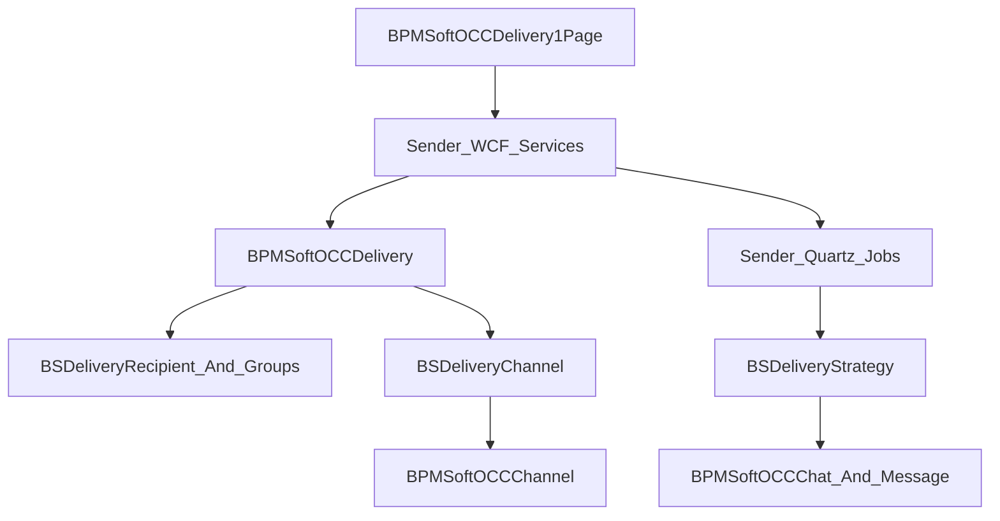

# BPMSoftSender в OCC-контуре

<!-- Версия: 1.0 | Обновлено: 2026-04-23 | Платформа: BPMSoft 1.9 -->
<!-- Теги: Sender, OCC, delivery, broadcast, scheduler, recipient, macros -->

> Расширенный документ по пакету `BPMSoftSender`: рассылки, доменная модель, scheduler, сервисы и связь с OCC-чатами и каналами.

## Обзор

`BPMSoftSender` - это подсистема массовых рассылок поверх OCC. Она использует OCC-каналы и чат-модель, но добавляет собственный домен:

- сущность рассылки;
- получателей и группы получателей;
- каналы доставки;
- типы старта и статусы;
- macros для генерации текста;
- Quartz-сценарии запуска и сопровождения доставки.

Важный принцип: Sender не отправляет “мимо OCC”. Он использует каналы, создаёт или обновляет OCC-чаты и OCC-сообщения.

## Архитектурная схема

## 1. Доменная модель

### Основная сущность

`BPMSoftOCCDelivery` - центральная сущность рассылки.

По схеме и UI видно, что в ней хранятся:

- `Name`
- `Active`
- `RecipientCount`
- `Comment`
- `Type`
- `Category`
- `Chatbot`
- `Text`
- `StartType`
- `ExpressionTypeColumn`
- `StartDateTimeColumn`
- `EndDateTimeColumn`
- `CronExpressionColumn`
- `SingleRunStartDateTimeColumn`
- `Status`
- `ImageUrl`
- `ContentTypeMessage`

Это делает `BPMSoftOCCDelivery` одновременно:

- карточкой настройки кампании;
- источником параметров для scheduler;
- носителем контента сообщения.

### Связанные сущности

| Сущность | Назначение |
| ----- | ----- |
| `BSDeliveryRecipient` | Получатели |
| `BSDeliveryRecipientGroup` | Группы получателей по папкам контактов |
| `BSDeliveryChannel` | Каналы доставки |
| `BSDeliverySender` | Связка рассылки и канала |
| `BSMacros` | Макросы для подстановки в текст |
| `BPMSoftOCCDeliveryFile` | Файлы рассылки |
| `BPMSoftOCCMessageContentType` | Тип контента сообщения |

### Lookup'и и статусы

Ключевые типы и статусы представлены как GUID-константы в `BSConstants.BPMSoftSender.js`:

| Группа | Значения |
| ----- | ----- |
| `StartType` | `ByCommand`, `BySchedule` |
| `DeliveryType` | `ChatBot`, `TextMessage` |
| `DeliveryContentType` | `Text`, `Picture`, `File`, `FileText`, `PictureText` |
| `Status` | `InWaiting`, `Running`, `Finished`, `ReadyForStart` |

## 2. UI страницы рассылки

Основной клиентский модуль - `Autogenerated/Src/BPMSoftOCCDelivery1Page.BPMSoftSender.js`.

Страница управляет:

- переключением между стартом по команде и по расписанию;
- редактированием cron expression и дат запуска;
- видимостью текстовых/файловых полей в зависимости от типа сообщения;
- активностью кнопок отправки и планирования;
- обновлением деталей каналов и получателей;
- вызовами сервисов Sender.

Также в пакете есть клиентские страницы для отдельных cron expression сценариев:

- `BPMSoftOCCDailyCronExpressionPage`
- `BPMSoftOCCWeeklyCronExpressionPage`
- `BPMSoftOCCMonthlyCronExpressionPage`
- `BPMSoftOCCYearCronExpressionPage`
- `BPMSoftOCCMinuteHourCronExpressionPage`
- `BPMSoftOCCCustomCronExpressionPage`

Это означает, что Sender реализует собственный UI-конструктор расписаний поверх OCC delivery page.

## 3. Сервисы Sender

### `BSDeliveryService`

Отвечает за жизненный цикл рассылки:

| Метод | Назначение |
| ----- | ----- |
| `StartDelivery(deliveryId)` | Запуск рассылки |
| `StopDelivery(deliveryId)` | Остановка рассылки |
| `ResetRecipientStatus(deliveryId)` | Сброс статусов получателей |

Во время `StartDelivery(...)` сервис:

- планирует служебные sender job'ы;
- обновляет статус рассылки;
- подготавливает recipients/channels.

### `BSSchedulerService`

Отвечает за расписание:

| Метод | Назначение |
| ----- | ----- |
| `AddProcessToScheduleCronExp(...)` | Cron-запуск рассылки |
| `AddProcessToScheduleSingleRun(...)` | Разовый запуск |
| `RemoveProcessFromSchedule(...)` | Удаление расписания |
| `SetRunningDeliveryStatus(deliveryId)` | Перевод в running и запуск sender job'ов |

### `RecipientGroupService`

Используется для работы с деталями групп получателей:

| Метод | Назначение |
| ----- | ----- |
| `AddRecipientGroup(currentDeliveryId, contactFolders)` | Добавление групп через папки контактов |
| `DeleteRecipientByDeliveryId(deliveryId)` | Очистка автоматически добавленных получателей |

## 4. Quartz и фоновые job'ы

### `BPMSoftSenderDeliverySchedulerJob`

Запускается как class job с интервалом 15 секунд.

Назначение:

- получает получателей без статуса;
- вызывает `BSDeliveryStrategy`;
- обрабатывает отправку сообщений по каналам;
- создаёт/обновляет OCC-чаты и сообщения.

### `BPMSoftSenderStatusJob`

Запускается как class job с интервалом 120 секунд.

Назначение:

- актуализирует статусы рассылок;
- переводит рассылки в `InWaiting` / `Finished` по бизнес-условиям.

### `BSChatRoutingJob`

Запускается каждые 10 минут.

Назначение:

- ищет “повреждённые” открытые OCC-чаты, связанные с доставкой;
- повторно отправляет их в `ApiService.PushChat(...)`.

Это служебный восстановительный сценарий Sender + OCC.

## 5. `BSDeliveryStrategy` - ядро доставки

Класс `BSDeliveryStrategy` реализует основную логику доставки.

Основные обязанности:

- выбор получателей;
- выбор каналов доставки;
- построение текста с macros;
- создание/обновление `BPMSoftOCCChat`;
- создание `BPMSoftOCCChatMessage` нужного типа;
- обновление статусов `BSDeliveryRecipient` и `BPMSoftOCCDelivery`.

### Как работает отправка

1. Извлекаются контакты и каналы.
2. Для каждого контакта выбирается подходящий канал.
3. Проверяется/находится корректный чат.
4. Создаётся новый чат доставки или используется существующий.
5. Создаются текстовые, image или file message records.
6. Статус получателя обновляется.

### Macros

Для генерации текста используется `BSMacros`:

- макросы читаются как сущности;
- пути к полям контакта извлекаются из `Path`;
- значения подставляются в текст сообщения перед отправкой.

## 6. Работа с получателями

`BSDeliveryUtilities`:

- разворачивает группы получателей по `ContactFolder`;
- строит ESQ-фильтры из `SearchData`;
- формирует список `BSRecipient`;
- создаёт записи `BSDeliveryRecipient`, если их ещё нет.

Это значит, что detail группы получателей - не просто UI-справочник, а динамический источник набора контактов для доставки.

## 7. Статусная модель

По коду используются как минимум следующие состояния:

| Статус | Смысл |
| ----- | ----- |
| `ReadyForStart` | Рассылка подготовлена, но ещё не выполняется |
| `InWaiting` | Ожидает времени запуска / находится в расписании |
| `Running` | Выполняется |
| `Finished` | Завершена |

Отдельно у получателей есть статус доставки (`BSDeliveryStatusForRecipient`), который обновляется в зависимости от результата отправки.

## 8. Типовые сценарии

### Сценарий 1. Разовая отправка

1. Пользователь заполняет карточку `BPMSoftOCCDelivery`.
2. Выбирает старт по команде.
3. UI вызывает sender service.
4. Запускаются sender job'ы и начинается обработка recipients.

### Сценарий 2. Рассылка по расписанию

1. Пользователь задаёт cron или single run date.
2. `BSSchedulerService` создаёт process job.
3. При срабатывании меняются статусы и стартуют sender job'ы.
4. `BSDeliveryStrategy` выполняет фактическую доставку.

### Сценарий 3. Восстановление доставки

1. `BSChatRoutingJob` находит незавершённые/повреждённые OCC-чаты доставки.
2. Вызывает `PushChat(...)`.
3. OCC повторно подхватывает processing flow.

## 9. Когда искать Sender

Открывай `BPMSoftSender`, если задача связана с:

- карточкой рассылки;
- cron/single-run доставкой;
- группами получателей;
- macros;
- статусами рассылки и статусов получателей;
- массовой отправкой в OCC-чаты;
- служебными sender job'ами.

Если задача только про обычный операторский чат или routing без рассылки, начни с OCC-документов, а не с Sender.

## Ключевые файлы

| Область | Файл |
| ----- | ----- |
| Основной сервис и стратегия | `Autogenerated/Src/BSDeliverySource.BPMSoftSender.cs` |
| Scheduler service | `Autogenerated/Src/BSSchedulerService.BPMSoftSender.cs` |
| Routing recovery job | `Autogenerated/Src/BSRoutingJob.BPMSoftSender.cs` |
| Recipient groups | `Autogenerated/Src/RecipientGroupService.BPMSoftSender.cs` |
| Recipient expansion utilities | `Autogenerated/Src/BSDeliveryUtilities.BPMSoftSender.cs` |
| Delivery entity | `Autogenerated/Src/BPMSoftOCCDeliverySchema.BPMSoftSender.cs` |
| Delivery page | `Autogenerated/Src/BPMSoftOCCDelivery1Page.BPMSoftSender.js` |
| Constants | `Autogenerated/Src/BSConstants.BPMSoftSender.js` |

## Связанные документы

- [Обзор OCC-архитектуры](../architecture/bpmsoft-occ.md)
- [Сервисы OCC и Sender](../server/bpmsoft-occ-services.md)
- [Сущности OCC и Sender](../reference/bpmsoft-occ-entities.md)
- [Quartz / AppScheduler](../server/scheduler-quartz.md)
