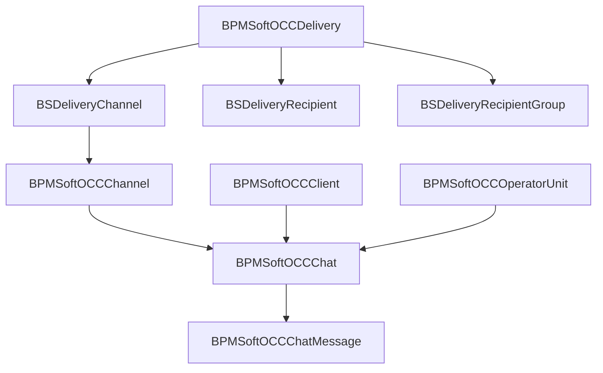

# Сущности OCC и Sender

<!-- Версия: 1.0 | Обновлено: 2026-04-23 | Платформа: BPMSoft 1.9 -->
<!-- Теги: OCC, Sender, entities, chat, channel, operator, delivery -->

> Краткий справочник ключевых сущностей OCC-контура. Не заменяет полный каталог [entity-catalog.md](entity-catalog.md), а выделяет наиболее важные схемы пакетов `BPMSoftOCC`, `BPMSoftOCCWAMfmsJson`, `BPMSoftSender`.

## Обзор

Сущности OCC можно условно разделить на 4 группы:

- каналы и конфигурация;
- чаты, сообщения и клиенты;
- операторы, очереди и routing;
- рассылки Sender поверх OCC.

## 1. Каналы и конфигурация

| Сущность | Назначение |
| ----- | ----- |
| `BPMSoftOCCChannel` | Основная запись канала: тип, вес, токен, конфигурация, webhook-related данные |
| `BPMSoftOCCChannelType` | Тип канала (Facebook, Telegram, WhatsApp и т.д.) |
| `BPMSoftOCCChatConfiguration` | Общая конфигурация OCC: close/transfer timeout и др. |
| `BPMSoftOCCChatSettings` | Сервисные настройки OCC, в том числе признаки поведения чата |
| `BPMSoftOCCLog` | Логирование OCC-событий |

Ключевые схемы:

- `Autogenerated/Src/BPMSoftOCCChannelSchema.BPMSoftOCC.cs`
- `Autogenerated/Src/BPMSoftOCCChannelTypeSchema.BPMSoftOCC.cs`
- `Autogenerated/Src/BPMSoftOCCChatConfigurationSchema.BPMSoftOCC.cs`
- `Autogenerated/Src/BPMSoftOCCChatSettingsSchema.BPMSoftOCC.cs`
- `Autogenerated/Src/BPMSoftOCCLogSchema.BPMSoftOCC.cs`

## 2. Чаты, сообщения и клиенты

| Сущность | Назначение |
| ----- | ----- |
| `BPMSoftOCCChat` | Основная сущность диалога |
| `BPMSoftOCCChatMessage` | Сообщения чата |
| `BPMSoftOCCClient` | Клиент/посетитель, связанный с чатом |
| `BPMSoftOCCSession` | Сессия взаимодействия |
| `BPMSoftOCCChatFile` | Файлы чата |
| `BPMSoftOCCChatRequest` | Входящие сырые запросы/пакеты от connector |
| `BPMSoftOCCNotSendMessage` | Служебная сущность неотправленных сообщений |
| `BPMSoftOCCOriginalChatMessage` | Оригинальное сообщение для reply/edit сценариев |
| `BPMSoftOCCChatTransfer` | Фиксация transfer-сценария |

Справочники и служебные lookup'и:

- `BPMSoftOCCChatState`
- `BPMSoftOCCChatType`
- `BPMSoftOCCChatCategory`
- `BPMSoftOCCChatSubCategory`
- `BPMSoftOCCCloseChat`
- `BPMSoftOCCReplyAuthor`
- `BPMSoftOCCChatMessageOutgoingStatus`
- `BPMSoftOCCChatMessageDeletionStatus`
- `BPMSoftOCCChatMessageEditStatus`

Подробную карту message type, outgoing/edit/delete статусов и rich-content см. в [occ-message-types.md](occ-message-types.md).

Ключевые схемы:

- `Autogenerated/Src/BPMSoftOCCChatSchema.BPMSoftOCC.cs`
- `Autogenerated/Src/BPMSoftOCCChatMessageSchema.BPMSoftOCC.cs`
- `Autogenerated/Src/BPMSoftOCCClientSchema.BPMSoftOCC.cs`
- `Autogenerated/Src/BPMSoftOCCSessionSchema.BPMSoftOCC.cs`
- `Autogenerated/Src/BPMSoftOCCChatRequestSchema.BPMSoftOCC.cs`

## 3. Операторы, группы и routing

| Сущность | Назначение |
| ----- | ----- |
| `BPMSoftOCCOperatorUnit` | Операторская единица с активностью, статусом, весом и позицией в очереди |
| `BPMSoftOCCOperatorChannel` | Привязка оператора к каналу |
| `BPMSoftOCCOperatorGroup` | Группа операторов |
| `BPMSoftOCCChatOperator` | Связь чат ↔ оператор |
| `BPMSoftOCCAfkTransfer` | Служебная сущность AFK transfer |
| `BPMSoftOCCOnlineUsers` | Онлайн-пользователи OCC |
| `BPMSoftOCCOperatorStatus` | Lookup статусов оператора |
| `BPMSoftOCCAfkStatusMode` | Lookup AFK-режимов |

Эти сущности участвуют в:

- выборе оператора для чата;
- queue/routing логике;
- group transfer;
- logout/AFK обработке.

Ключевые схемы:

- `Autogenerated/Src/BPMSoftOCCOperatorUnitSchema.BPMSoftOCC.cs`
- `Autogenerated/Src/BPMSoftOCCOperatorChannelSchema.BPMSoftOCC.cs`
- `Autogenerated/Src/BPMSoftOCCOperatorGroupSchema.BPMSoftOCC.cs`
- `Autogenerated/Src/BPMSoftOCCChatOperatorSchema.BPMSoftOCC.cs`
- `Autogenerated/Src/BPMSoftOCCAfkTransferSchema.BPMSoftOCC.cs`

## 4. Групповые чаты и служебные объекты UI

| Сущность | Назначение |
| ----- | ----- |
| `BPMSoftOCCGroupChat` | Групповой чат |
| `BPMSoftOCCGroupChatParticipant` | Участники группового чата |
| `BPMSoftOCCGroupChatFile` | Файлы группового чата |
| `BPMSoftOCCGroupChatFolder` / `InFolder` / `Tag` / `InTag` | Папки и теги групповых чатов |
| `BPMSoftOCCHotMessage` / `BPMSoftOCCHotMessageType` | Горячие сообщения |
| `BPMSoftOCCButtonMessage`, `BPMSoftOCCCaruselMessage`, `BPMSoftOCCFileMessage`, `BPMSoftOCCImageMessage`, `BPMSoftOCCLocationMessage` | Типизированные message entities/DTO-сценарии |

Эта группа важна, если задача касается UI операторов, групповых каналов и специальных форматов сообщений.

## 5. Sender: сущности рассылок поверх OCC

### Основная сущность доставки

| Сущность | Назначение |
| ----- | ----- |
| `BPMSoftOCCDelivery` | Основная запись рассылки |
| `BPMSoftOCCDeliveryFile` | Файлы рассылки |
| `BPMSoftOCCDeliveryFolder` | Папки рассылок |
| `BPMSoftOCCDeliveryTag` | Теги рассылок |
| `BPMSoftOCCDeliveryInFolder` / `BPMSoftOCCDeliveryInTag` | Связующие сущности папок/тегов |
| `BPMSoftOCCMessageContentType` | Тип контента сообщения рассылки |

Ключевая схема:

- `Autogenerated/Src/BPMSoftOCCDeliverySchema.BPMSoftSender.cs`

### Получатели и каналы рассылки

| Сущность | Назначение |
| ----- | ----- |
| `BSDeliveryRecipient` | Получатель рассылки |
| `BSDeliveryRecipientGroup` | Группы получателей через папки контактов |
| `BSDeliveryChannel` | Каналы, по которым будет выполняться рассылка |
| `BSDeliverySender` | Связка delivery ↔ channel/sender |
| `BSMacros` | Макросы для генерации текста сообщения |

### Справочники Sender

| Сущность | Назначение |
| ----- | ----- |
| `BSDeliveryStartType` | Тип старта: по команде / по расписанию |
| `BSDeliveryType` | Тип рассылки |
| `BSDeliveryStatus` | Статус рассылки |
| `BSDeliveryStatusForRecipient` | Статус доставки для получателя |
| `BSDeliveryCategory` | Категория рассылки |

## 6. Бизнес-связи между OCC и Sender

Sender не является отдельной изолированной подсистемой. Он использует OCC-модель:

- `BSDeliveryChannel.Channel` ссылается на `BPMSoftOCCChannel`;
- `BSDeliveryChannel.Delivery` ссылается на `BPMSoftOCCDelivery`;
- `BSDeliverySender` связывает доставку и канал;
- логика отправки в `BSDeliveryStrategy` создаёт/обновляет `BPMSoftOCCChat` и `BPMSoftOCCChatMessage`.

То есть доставка Sender фактически работает как надстройка над каналами и чатами OCC.

## 7. Практический минимум для большинства задач

Если нужно быстро понять OCC-контур, обычно достаточно начать с этих сущностей:

| Задача | С чего начать |
| ----- | ----- |
| Каналы и webhook | `BPMSoftOCCChannel`, `BPMSoftOCCChannelType` |
| Операторский чат | `BPMSoftOCCChat`, `BPMSoftOCCChatMessage`, `BPMSoftOCCClient` |
| Routing/очереди | `BPMSoftOCCOperatorUnit`, `BPMSoftOCCOperatorChannel`, `BPMSoftOCCAfkTransfer` |
| Callback/request pipeline | `BPMSoftOCCChatRequest` |
| Рассылки | `BPMSoftOCCDelivery`, `BSDeliveryRecipient`, `BSDeliveryChannel`, `BSMacros` |

## Связанные документы

- [Обзор OCC-архитектуры](../architecture/bpmsoft-occ.md)
- [Сервисы OCC и Sender](../server/bpmsoft-occ-services.md)
- [Request pipeline OCC](../server/occ-request-pipeline.md)
- [Типы сообщений OCC](occ-message-types.md)
- [Настройки OCC](bpmsoft-occ-settings.md)
- [Troubleshooting OCC](../server/occ-troubleshooting.md)
- [Sender в OCC-контуре](../extended/bpmsoft-sender.md)
