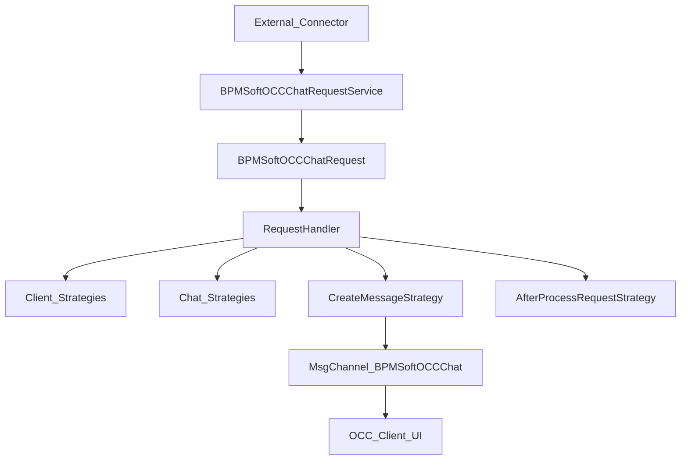

# OCC Request Pipeline

<!-- Версия: 1.0 | Обновлено: 2026-04-27 | Платформа: BPMSoft 1.9 -->
<!-- Теги: OCC, request pipeline, webhook, RequestHandler, callback, status, typing -->

> Подробный документ по server-side pipeline обработки входящих OCC-событий: от webhook/request payload до создания клиента, чата, сообщения и отправки websocket-обновлений в UI.

## Обзор

В OCC входящие события от connector проходят через несколько слоёв:

1. WCF endpoint принимает payload.
1. Сырой JSON сохраняется в `BPMSoftOCCChatRequest`.
1. `RequestHandler` проверяет канал, клиента и чат.
1. Pipeline создаёт или находит сущности `BPMSoftOCCClient`, `BPMSoftOCCChat`, `BPMSoftOCCChatMessage`.
1. После обработки запись request помечается как `Processed = true`.
1. UI получает связанные websocket-сообщения через `BPMSoftOCCChat`.

## Точки входа

### `BPMSoftOCCChatRequestService`

Основной входной сервис находится в `Autogenerated/Src/BPMSoftOCCChatRequestService.BPMSoftOCC.cs`.

Ключевые методы:

| Метод | Что делает |
| ----- | ----- |
| `SendBPMSoftOCCChatRequestCollection(requestBody)` | Принимает wrapped request, сохраняет raw JSON в `BPMSoftOCCChatRequest`, сразу вызывает `RequestHandler.ProcessRequest(...)` |
| `SendTypingClientTextCollection(requestBody)` | Принимает typing-событие и отправляет websocket-сообщение `ClientIsTyping` |
| `SendMessageStatuses(messageStatuses)` | Batch-обработка статусов исходящих сообщений |
| `SendMessageStatus(messageStatus)` | Обработка одного статуса сообщения |
| `SendMessageStatusWrapped(...)`, `SendMessageStatusesWrapped(...)` | Wrapped-варианты для status callbacks |

Важно: сервис не только сохраняет сырой запрос, но и пытается обработать его синхронно в том же запросе.

### `BPMSoftOCCChatRequest` как очередь/журнал

Сущность `BPMSoftOCCChatRequest` находится в `Autogenerated/Src/BPMSoftOCCChatRequestSchema.BPMSoftOCC.cs`.

Ключевые поля:

| Поле | Назначение |
| ----- | ----- |
| `Request` | Полный raw JSON request |
| `Processed` | Признак успешной обработки pipeline |

Практически это одновременно:

- журнал входящих запросов;
- буфер на случай отложенной обработки;
- источник для повторного запуска через job/event process.

## Три фактических пути обработки request

По коду pipeline работает не в одном месте, а сразу в трёх:

### 1. Синхронно из WCF-сервиса

`SendBPMSoftOCCChatRequestCollection(...)`:

- парсит `requestBody`;
- берёт `content["Request"]`;
- вставляет запись в `BPMSoftOCCChatRequest`;
- сразу вызывает `new RequestHandler(UserConnection).ProcessRequest(...)`.

### 2. Через entity event на вставку `BPMSoftOCCChatRequest`

В `BPMSoftOCCChatRequest_BPMSoftOCCEventsProcess` на `Inserted` вызывается:

- логирование `EVENT(ChatRequestInserted)`;
- десериализация `Entity.Request`;
- повторный `requestHandler.ProcessRequest(request)`.

То есть даже если request уже был обработан в сервисе, у записи есть отдельный event-driven путь.

### 3. Через `RequestHandlingJob`

В `Autogenerated/Src/BPMSoftOCCStrategy.BPMSoftOCC.cs` есть `RequestHandlingJob`, который:

- выбирает `BPMSoftOCCChatRequest` с `Processed = false`;
- группирует их по `InternalId`;
- сортирует сообщения внутри группы по `CreatedOn`;
- повторно вызывает `ProcessRequest(...)`.

Это выглядит как recovery/fallback-путь для необработанных или частично обработанных request'ов.

## `RequestHandler` и его стратегии

Класс `RequestHandler` реализован в `Autogenerated/Src/BPMSoftOCCStrategy.BPMSoftOCC.cs`.

Он собирается из стратегий:

| Стратегия | Роль |
| ----- | ----- |
| `ChannelExistsStrategy` | Проверка существования канала |
| `ClientExistsStrategy` | Поиск клиента |
| `CreateClientStrategy` | Создание `BPMSoftOCCClient` |
| `ChatExistsStrategy` | Поиск существующего чата |
| `CreateChatStrategy` | Создание чата |
| `CreateMessageStrategy` | Создание сообщения |
| `GroupChatParticipantStrategy` | Добавление участника в group chat |
| `AfterProcessRequestStrategy` | Пометка request как обработанного |

### Алгоритм `ProcessRequest(...)`

В упрощённом виде:

1. Проверяется существование канала.
1. Ищутся чат и клиент.
1. Если чего-то нет, используется `MutexFactory.GetOrAdd(request.Sender.ShortInternalId)`.
1. Внутри mutex повторно проверяются клиент и чат.
1. При необходимости создаются клиент и чат.
1. Для group chat добавляется участник.
1. Создаётся сообщение.
1. Вызывается `AfterProcessRequestStrategy`, который ставит `Processed = true`.

Использование mutex важно: OCC защищается от дублей при параллельных сообщениях одного и того же отправителя.

## DTO запроса

`Request` в `BPMSoftOCCStrategy.BPMSoftOCC.cs` содержит основную интеграционную модель входящего события.

Ключевые поля:

| Поле | Назначение |
| ----- | ----- |
| `Id` | Идентификатор request / CRM-request |
| `InternalId` | Внутренний идентификатор чата/клиента во внешней системе |
| `CreatedOn` | Время события |
| `Text` | Текст сообщения |
| `Sender` | Информация об отправителе |
| `ChannelId` | Канал OCC |
| `Type` | Тип сообщения |
| `ExternalMessageId` | Внешний id сообщения |
| `MessageChatInfo` | Информация о внешнем чате |

### `Sender`

DTO `Sender` содержит:

- `Name`
- `Country`
- `Language`
- `NickName`
- `Avatar`
- `InternalId`

Отдельно есть `ShortInternalId`, который:

- возвращает `InternalId` как есть;
- либо, если `InternalId` - JSON, извлекает вложенный `Id`.

Это особенно важно для каналов, где sender id приходит не простой строкой, а JSON-структурой.

### `MessageChatInfo`

Используется для внешней информации о чате:

- `ExternalId`
- `ChatTitle`
- `ChatType`

`ChatType` поддерживает:

- `Private`
- `Group`

Для `Group` pipeline дополнительно запускает `GroupChatParticipantStrategy`.

## Как request переходит в сущности

### Клиент

`CreateClientStrategy` создаёт `BPMSoftOCCClient` из данных `Sender`:

- `InternalId`
- `Country`
- `PhotoSrc`
- `NickName`
- `Language`
- `Name`

### Чат

`ChatExistsStrategy` и `CreateChatStrategy` работают через `EntityApplicationCache`.

Кэш нужен для:

- поиска чата по `ShortInternalId` / `InternalId`;
- снижения количества повторных ESQ-запросов;
- безопасной работы pipeline при частых входящих сообщениях.

### Сообщение

`CreateMessageStrategy` создаёт `BPMSoftOCCChatMessage` и связанные специализированные типы сообщений. Подробная карта типов вынесена в [occ-message-types.md](../reference/occ-message-types.md).

## Typing events

`SendTypingClientTextCollection(...)` не создаёт новую сущность сообщения.

Вместо этого сервис:

1. находит открытый `BPMSoftOCCChat` по `Sender.InternalId`, `Channel.Id`, `Closed = false`;
1. убеждается, что найден ровно один чат;
1. собирает websocket payload с заголовком `ClientIsTyping`;
1. публикует его через `MsgChannelUtilities.PostMessageToAll("BPMSoftOCCChat", msg)`.

Это transient-сигнал для UI, а не полноценная запись в message history.

## Status callback pipeline

Статусы исходящих сообщений обрабатываются через `BPMSoftOCCChatMessageStatusRequestHandler`.

### Что делает handler

| Шаг | Действие |
| ----- | ----- |
| 1 | Валидирует входной DTO |
| 2 | Загружает словарь статусов `BPMSoftOCCChatMessageOutgoingStatus` |
| 3 | Обновляет `OutgoingStatusId` у `BPMSoftOCCChatMessage` |
| 4 | Формирует DTO для фронта |
| 5 | Отправляет websocket-сообщение `MessageBatchStatusUpdate` |

### Важные детали реализации

- статус с кодом `100` (`Created`) игнорируется;
- обновление в БД выполняется только если новый status code больше текущего;
- если есть `ExternalMessageId`, включается отдельная стратегия `ExternalIdIsNotNullStrategy`;
- для Viber есть special-case: при статусе `Read` обновляются и другие сообщения чата из статуса `Delivered`.

## Websocket-сообщения и UI

Pipeline тесно связан с websocket-сообщениями канала `BPMSoftOCCChat`.

По коду используются как минимум:

| Header | Кто отправляет | Для чего |
| ----- | ----- | ----- |
| `NewChat` | `ApiService.PushChat(...)` | Новый чат для оператора |
| `CloseChats` | `ApiService.PushChat(...)` | Закрыть чат у остальных клиентов/операторов |
| `ClientIsTyping` | `BPMSoftOCCChatRequestService` | Печатание клиента |
| `MessageBatchStatusUpdate` | `BPMSoftOCCChatMessageStatusRequestHandler` | Обновление статусов сообщений |
| `EditMessageUpdate` | edit-message pipeline | Обновление текста/состояния сообщения |

`BPMSoftOCCChatSchema.BPMSoftOCC.js` принимает эти события и публикует их в sandbox:

- `NewChat`
- `NewMessage`
- `UpdateChat`
- `ClientIsTyping`
- `MessageStatusUpdate`
- `MessageEditStatusUpdate`

Поэтому request pipeline нельзя рассматривать отдельно от OCC UI.

## Антипаттерны и ограничения

- Не считать `BPMSoftOCCChatRequestService` единственной точкой обработки: есть ещё entity event и `RequestHandlingJob`.
- Не считать `BPMSoftOCCChatRequest` просто журналом: поле `Processed` реально участвует в recovery-логике.
- Не смешивать typing event и обычное сообщение: typing идёт напрямую в websocket-канал.
- Не предполагать, что `InternalId` всегда простая строка: часть каналов передаёт JSON.

## Когда открывать этот документ

Смотри сюда, если задача связана с:

- webhook/callback обработкой;
- дублями клиентов/чатов;
- порядком обработки входящих сообщений;
- `Processed = false` в `BPMSoftOCCChatRequest`;
- typing/status callback сценарием;
- websocket header `ClientIsTyping` или `MessageBatchStatusUpdate`.

## Ключевые файлы

| Область | Файл |
| ----- | ----- |
| WCF входная точка | `Autogenerated/Src/BPMSoftOCCChatRequestService.BPMSoftOCC.cs` |
| Request entity | `Autogenerated/Src/BPMSoftOCCChatRequestSchema.BPMSoftOCC.cs` |
| Основной pipeline | `Autogenerated/Src/BPMSoftOCCStrategy.BPMSoftOCC.cs` |
| API / websocket side effects | `Autogenerated/Src/BPMSoftOCCApi.BPMSoftOCC.cs` |
| Status handler | `Autogenerated/Src/BPMSoftOCCChatMessageStatusRequestHandler.BPMSoftOCC.cs` |
| UI consumers | `Autogenerated/Src/BPMSoftOCCChatSchema.BPMSoftOCC.js` |

## Связанные документы

- [Архитектура OCC](../architecture/bpmsoft-occ.md)
- [Сервисы OCC и Sender](bpmsoft-occ-services.md)
- [Routing и strategy](occ-routing-strategy.md)
- [Типы сообщений OCC](../reference/occ-message-types.md)
- [Troubleshooting OCC](occ-troubleshooting.md)
