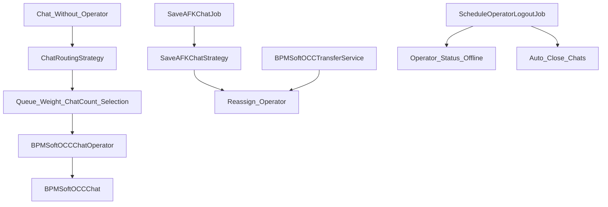

# OCC Routing, Queue и AFK/Transfer

<!-- Версия: 1.0 | Обновлено: 2026-04-27 | Платформа: BPMSoft 1.9 -->
<!-- Теги: OCC, routing, queue, operator, AFK, transfer, ChatRoutingJob -->

> Подробный документ по OCC routing-логике: как выбирается оператор, как учитываются вес канала и очередь, какие recovery/AFK/logout сценарии работают в фоне.

## Обзор

Routing в OCC распределён между несколькими компонентами:

- `ChatRoutingStrategy` - основной алгоритм назначения оператора;
- `ChatRoutingRepository` - SQL/ESQ-доступ к чатам и операторам;
- `SaveAFKChatStrategy` - обработка “молчащих” или AFK-чатов;
- `BPMSoftOCCTransferService` - ручной transfer в группу;
- `ScheduleOperatorLogoutJob` - авто-offline и auto-close сценарии;
- `ChatRoutingJob` и `SaveAFKChatJob` - Quartz job'ы для периодического запуска.



## Основные сущности и модели

Routing использует несколько внутренних моделей из `BPMSoftOCCRouting.BPMSoftOCC.cs`.

| Модель | Назначение |
| ----- | ----- |
| `Chat` | Упрощённая модель OCC-чата для routing |
| `Chat.ChatChannel` | Канал чата, тип канала и его вес |
| `OperatorQueuePosition` | Срез данных по оператору: очередь, вес, число чатов |
| `ChatOperator` | Модель назначения чата оператору |

### Что учитывается в `OperatorQueuePosition`

По SQL-агрегации в `GetSelectedChannelsOperatorInfo(...)` учитываются:

- `ChannelId`
- `SysAdminUnitOperatorId`
- `OperatorId`
- `OperatorContactId`
- `OperatorType`
- `MaxWeight`
- `MaxQueuePosition`
- `CurrentOperatorWeight`
- `CurrentOperatorChatCount`

То есть решение о routing зависит не только от очереди, но и от текущей нагрузки по весу и количеству чатов.

## `ChatRoutingRepository`

Репозиторий отвечает за две ключевые выборки:

| Метод | Назначение |
| ----- | ----- |
| `GetChatsWithoutOperator(...)` | Получить чаты без назначенного оператора |
| `GetSelectedChannelsOperatorInfo(channelIds)` | Получить операторов, доступных для указанных каналов |

### Как выбираются кандидаты-операторы

В `GetSelectedChannelsOperatorInfo(...)` в выборку попадают только операторы:

- связанные с конкретным каналом через `BPMSoftOCCOperatorChannel`;
- со статусом `Status = 2`;
- `Active = true`.

Дополнительно считаются:

- суммарный вес уже назначенных открытых чатов;
- текущее число открытых чатов;
- максимальная позиция в очереди.

Это и есть основной источник данных для последующего выбора оператора.

### Сохранение назначения

После выбора операторов `SaveChatOperators(...)`:

- формирует записи `BPMSoftOCCChatOperator`;
- вызывает `OnInserting`/`OnInserted` entity listeners через `EntityEventContext`;
- пишет записи через SQL insert;
- обновляет поля `OperatorId` и `OperatorContactId` в `BPMSoftOCCChat`.

Это важно: routing не ограничивается вставкой в журнал назначения, он также меняет сам чат.

## `ChatRoutingStrategy`

Основной класс - `ChatRoutingStrategy`.

### Общий алгоритм

1. Берутся чаты без оператора.
1. Исключаются чаты, уже обрабатываемые synchronizer'ом.
1. Выбираются все каналы этих чатов.
1. Загружается список подходящих операторов по каналам.
1. Для каждого чата выбирается лучший оператор.
1. Назначения сохраняются через `SaveChatOperators(...)`.

### `ChatRoutingStrategySyncronizer`

Используется для защиты от конкурентной обработки одного и того же чата.

Практический смысл:

- если несколько потоков/job'ов одновременно увидят чат без оператора,
- synchronizer позволяет назначать его только одному исполнителю.

## Алгоритм выбора оператора

### Шаг 1. Минимальная позиция в очереди

`GetOperatorsWithMinQueuePosition(...)`:

- выбирает операторов с минимальным `MaxQueuePosition`;
- для group chat исключает bot operators.

Это делает `QueuePosition` первым фильтром при выборе.

### Шаг 2. Доступный вес

`GetOperatorsWithAvailableWeight(...)` оставляет только операторов, у которых:

```text
CurrentOperatorWeight + ChannelWeight <= MaxWeight
```

То есть канал с большим весом может быть недоступен оператору даже при правильной очереди.

### Шаг 3. Минимальное количество чатов

Если после первых двух фильтров остаётся несколько кандидатов, выбирается оператор с минимальным `CurrentOperatorChatCount`.

### Итого

Routing в OCC = не round-robin, а каскадный отбор:

1. очередь;
1. доступный вес;
1. минимальное количество активных чатов.

## Ограничения и специальные случаи

### Widget-каналы и боты

`IsChatAvailableForOperator(...)` содержит важное ограничение:

- для widget channel оператор не назначается обычному оператору,
  если это не routing-first-message сценарий;
- логика завязана на `WidgetChannelTypeId` и `BotEngine.IsBotOperatorType(...)`.

### Первый маршрут vs последующие сообщения

`GetIsRouting(...)`:

- если включён `firstMessageRoute`, routing считается допустимым сразу;
- иначе OCC смотрит число клиентских сообщений через `ApiService.GetClientMessagesCount(chatId)`.

Это влияет на то, нужно ли повторно распределять чат.

## AFK и silent chats

### `SaveAFKChatStrategy`

Этот класс обрабатывает чаты, где оператор не отвечает или чат “застыл”.

### Как отбираются AFK-чаты

`GetChats(minutes)`:

- берёт открытые чаты;
- проверяет, что последнее сообщение старше заданного интервала;
- смотрит `IsOperatorLastMessage`;
- отдельно проверяет, не было ли последнее сообщение от бота;
- исключает чаты без оператора и bot-операторов.

### Что происходит дальше

Для найденного чата стратегия:

1. проверяет последнее `StartDate` у `BPMSoftOCCChatOperator`;
1. убеждается, что timeout действительно истёк;
1. находит альтернативных операторов того же канала;
1. выбирает оператора с минимальным числом чатов;
1. меняет `OperatorId` и `OperatorContactId` у чата;
1. сохраняет запись `BPMSoftOCCAfkTransfer`;
1. запускает процесс `BPMSoftOCCLogOperatorChange`.

То есть AFK-обработка - это не просто статус, а фактический transfer чата на другого оператора.

## Transfer-сценарии

### `BPMSoftOCCTransferService`

Сервис `StartTransferToGroupProcess(GroupId, ChatId)`:

1. получает `ChannelId` чата;
1. получает `QueuePosition` выбранной группы;
1. ищет подходящего оператора по каналу и этой позиции;
1. если оператор найден, меняет `OperatorId` у `BPMSoftOCCChat`.

### Как выбирается оператор в transfer

Внутри `FindOperatorId(...)` учитываются:

- канал;
- активные операторы `Status = 2`, `Active = true`;
- точное совпадение по `QueuePosition`;
- ограничение по весу (`CurrentWeight + ChannelWeight <= MaxWeight`);
- при нескольких кандидатах берётся оператор с минимальным значением позиции/нагрузки;
- если кандидатов несколько, tie-break идёт через историю последних сообщений операторов.

Это значит, что transfer в группу тоже остаётся load-aware, а не просто “возьми любого”.

## Logout и auto-close

### `ScheduleOperatorLogoutJob`

Job из `BPMSoftOCCOperatorLogoutSchema.BPMSoftOCC.cs` выполняет два действия:

- `LogoutHandler(...)`
- `AutoCloseChat(...)`

### `LogoutHandler(...)`

Переводит операторов offline, если:

- у них `Status = 2`;
- они не являются определённым типом operator unit;
- у них нет активной пользовательской сессии в `SysUserSession`.

По сути это self-healing сценарий для “висящих” онлайн-статусов.

### `AutoCloseChat(...)`

Если параметр `closeChat = true`, job:

- находит открытые чаты, где последнее сообщение старше `closeChatTimeout`;
- выставляет `Closed = true`.

Это отдельный механизм от AFK transfer:

- AFK пытается перевесить чат;
- auto-close завершает неактивный чат.

## Связанные job'ы

| Job | Что делает |
| ----- | ----- |
| `ChatRoutingJob` | Периодически запускает `ChatRoutingStrategy.Execute()` |
| `SaveAFKChatJob` | Периодически запускает `SaveAFKChatStrategy.Execute(seconds)` |
| `ScheduleOperatorLogoutJob` | Переводит операторов offline и закрывает простаивающие чаты |

Подробности по регистрации этих job'ов см. в [scheduler-quartz.md](scheduler-quartz.md).

## Когда смотреть этот документ

Открывай его, если задача связана с:

- выбором оператора для нового чата;
- очередями и `QueuePosition`;
- `Weight` канала и ограничением нагрузки;
- AFK transfer;
- ручным transfer в группу;
- auto-close / auto-logout;
- проблемами “чат без оператора”.

## Антипаттерны и риски

- Не считать, что routing зависит только от `QueuePosition`: вес канала и число чатов так же важны.
- Не путать AFK transfer и auto-close: это два разных механизма.
- Не описывать transfer как прямую замену `OperatorId` без условий: реальная логика учитывает статус, активность, вес и историю.
- Не забывать про group chat и bot operator исключения.

## Ключевые файлы

| Область | Файл |
| ----- | ----- |
| Основная routing-логика | `Autogenerated/Src/BPMSoftOCCRouting.BPMSoftOCC.cs` |
| Transfer service | `Autogenerated/Src/BPMSoftOCCTransferService.BPMSoftOCC.cs` |
| Logout / auto-close job | `Autogenerated/Src/BPMSoftOCCOperatorLogoutSchema.BPMSoftOCC.cs` |
| OCC API side effects | `Autogenerated/Src/BPMSoftOCCApi.BPMSoftOCC.cs` |

## Связанные документы

- [Архитектура OCC](../architecture/bpmsoft-occ.md)
- [Request pipeline](occ-request-pipeline.md)
- [Сервисы OCC и Sender](bpmsoft-occ-services.md)
- [Quartz / AppScheduler](scheduler-quartz.md)
- [Troubleshooting OCC](occ-troubleshooting.md)
