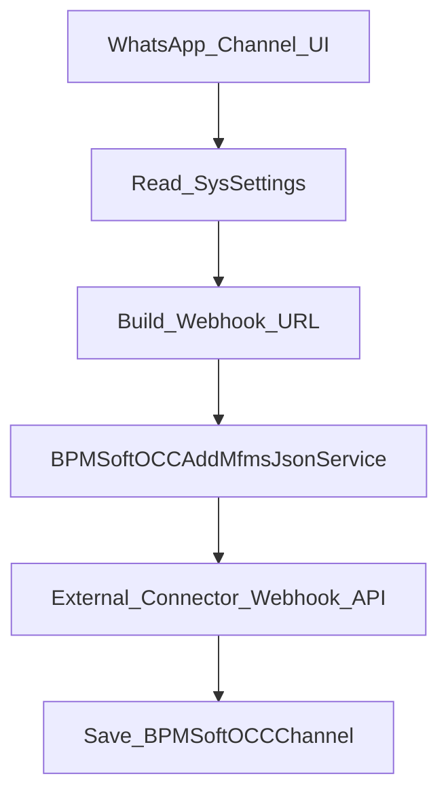

# WhatsApp MFMS / Edna в OCC

<!-- Версия: 1.0 | Обновлено: 2026-04-23 | Платформа: BPMSoft 1.9 -->
<!-- Теги: OCC, WhatsApp, MFMS, Edna, webhook, channel, WCF -->

> Документ по пакету `BPMSoftOCCWAMfmsJson`, который расширяет стандартный OCC-сценарий создания WhatsApp-канала.

## Назначение

Пакет `BPMSoftOCCWAMfmsJson` отвечает за специализированную интеграцию WhatsApp-канала в OCC. В отличие от базового сценария `AddWhatsAppChannel`, здесь:

- используется отдельный сервис `BPMSoftOCCAddMfmsJsonService`;
- параметры подключения хранятся в JSON внутри `BPMSoftOCCChannel.Token`;
- поддерживаются два режима webhook-интеграции:
  - актуальный `wa/edna`
  - legacy `wa/mfms/json`

Пакет включает и серверный слой, и клиентское переопределение страницы канала.

## Основной сценарий



## Серверный сервис `BPMSoftOCCAddMfmsJsonService`

Сервис находится в файле `Autogenerated/Src/BPMSoftOCCAddMfmsJsonService.BPMSoftOCCWAMfmsJson.cs`.

### Методы

| Метод | Назначение |
| ----- | ----- |
| `GetConnectorUrl()` | Возвращает базовый host BPMSoft для формирования webhook URL |
| `AddWhatsAppMfmsJsonChannel(...)` | Создание/обновление WhatsApp-канала в режиме `wa/edna` |
| `AddObsoleteWhatsAppMfmsJsonChannel(...)` | Legacy-метод для `wa/mfms/json` |

### Поведение `AddWhatsAppMfmsJsonChannel(...)`

Сервис:

1. читает `BPMSoftOCCOperatoHost`, `BPMSoftOCCServices`, `BPMSoftOCCOperatorAppId`;
1. собирает JSON payload вида:

```json
{
  "Url": "https://host/bpmsoftocchook/wa/edna/{AppId}/{BpmId}/",
  "BpmId": "channel-guid",
  "AppId": "app-id",
  "ApiKey": "api-key",
  "PhoneNumber": "phone",
  "CascadeId": "cascade-id"
}
```

1. отправляет POST на внешний endpoint:

```text
{BPMSoftOCCServices("wa/edna")}/api/v1/webhook
```

1. при успехе создаёт запись `BPMSoftOCCChannel` и записывает этот JSON в поле `Token`.

### Поведение legacy-метода

Legacy-вариант строит похожий payload, но:

- controller path: `wa/mfms/json`
- вместо `CascadeId` использует `Subject`

Пример JSON:

```json
{
  "Url": "https://host/bpmsoftocchook/wa/mfms/json/{AppId}/{BpmId}/",
  "BpmId": "channel-guid",
  "AppId": "app-id",
  "ApiKey": "api-key",
  "PhoneNumber": "phone",
  "Subject": "subject"
}
```

## Клиентская форма `BPMSoftOCCWhatsAppChannelView`

Клиентский view находится в `Autogenerated/Src/BPMSoftOCCWhatsAppChannelView.BPMSoftOCCWAMfmsJson.js`.

Что он меняет по сравнению с обычным WhatsApp channel view:

- удаляет стандартные Twilio-поля;
- добавляет поля `ApiKey`, `PhoneNumber`, `CascadeId`, `Subject`, `Webhook`;
- управляет видимостью `CascadeId` и `Subject`;
- на `init()` читает настройки и строит webhook URL;
- при `add()` вызывает `BPMSoftOCCAddMfmsJsonService`.

### Важные особенности UI

- `ConfigurationId` по умолчанию подставляется как `655425d2-2369-46c4-8296-5e7b0f0263db`;
- тип канала жёстко передаётся как `10000000-0000-0000-0000-000000000007`;
- генерируется новый GUID, который участвует в webhook path;
- webhook отображается пользователю до сохранения канала.

## Переопределение страницы канала

Файл `Autogenerated/Src/BPMSoftOCCChannelPage.BPMSoftOCCWAMfmsJson.js` меняет стандартную логику OCC channel page:

- для WhatsApp читает параметры из `Token` JSON;
- подставляет их в payload обновления;
- перенаправляет сохранение на сервис `BPMSoftOCCAddMfmsJsonService`;
- для WhatsApp использует метод `AddWhatsAppMfmsJsonChannel`.

Это значит, что для WhatsApp OCC работает не через общий `BPMSoftOCCAddChannelService`, а через специализированный сервис пакета `BPMSoftOCCWAMfmsJson`.

## Системные настройки

| Настройка | Назначение |
| ----- | ----- |
| `BPMSoftOCCOperatoHost` | Базовый host BPMSoft для webhook URL |
| `BPMSoftOCCServices` | Шаблон URL connector service |
| `BPMSoftOCCOperatorAppId` | Идентификатор приложения OCC |
| `BPMSoftOCCUseObsoleteWhatsAppApi` | Переключение между `wa/edna` и `wa/mfms/json` |

### Переключение режима

В `BPMSoftOCCWhatsAppChannelView`:

- если `BPMSoftOCCUseObsoleteWhatsAppApi = true`, показывается `Subject`, скрывается `CascadeId`;
- если настройка выключена, используется `CascadeId` и современный маршрут `wa/edna`.

## Поле `Token`

В этом пакете `Token` - не просто строковый токен, а сериализованный JSON с интеграционными параметрами.

Это важно учитывать при:

- чтении настроек канала;
- обновлении канала;
- переносе конфигурации;
- ручном анализе БД.

Именно поэтому `BPMSoftOCCChannelPage.BPMSoftOCCWAMfmsJson.js` при обновлении сначала парсит JSON из `Token`.

## Когда искать именно этот пакет

Используй `BPMSoftOCCWAMfmsJson`, если задача связана с:

- WhatsApp webhook registration;
- `wa/edna` или `wa/mfms/json`;
- `CascadeId` / `Subject`;
- хранением WhatsApp-конфигурации в `Token` JSON;
- нестандартным UI страницы WhatsApp OCC-канала.

Если задача про обычные OCC-каналы в целом, начни с `BPMSoftOCCAddChannelService` и [bpmsoft-occ-services.md](bpmsoft-occ-services.md).

## Ключевые файлы

| Область | Файл |
| ----- | ----- |
| WCF service | `Autogenerated/Src/BPMSoftOCCAddMfmsJsonService.BPMSoftOCCWAMfmsJson.cs` |
| Service schema | `Autogenerated/Src/BPMSoftOCCAddMfmsJsonServiceSchema.BPMSoftOCCWAMfmsJson.cs` |
| WhatsApp view | `Autogenerated/Src/BPMSoftOCCWhatsAppChannelView.BPMSoftOCCWAMfmsJson.js` |
| Channel page override | `Autogenerated/Src/BPMSoftOCCChannelPage.BPMSoftOCCWAMfmsJson.js` |
| CSS/visuals | `Autogenerated/Src/BPMSoftOCCMfmsJsonCss.BPMSoftOCCWAMfmsJson.js` и связанные `.less` |

## Связанные документы

- [Обзор OCC-архитектуры](../architecture/bpmsoft-occ.md)
- [Сервисы OCC и Sender](bpmsoft-occ-services.md)
- [Настройки OCC](../reference/bpmsoft-occ-settings.md)
